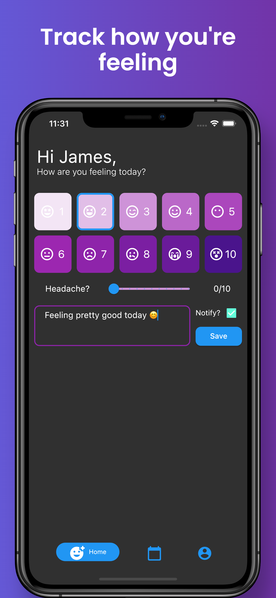
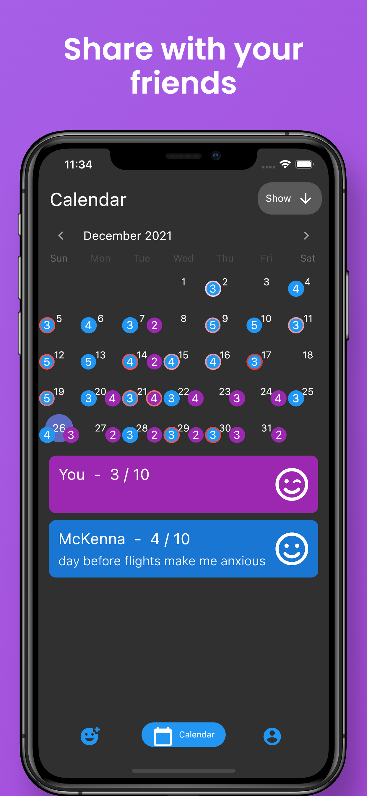
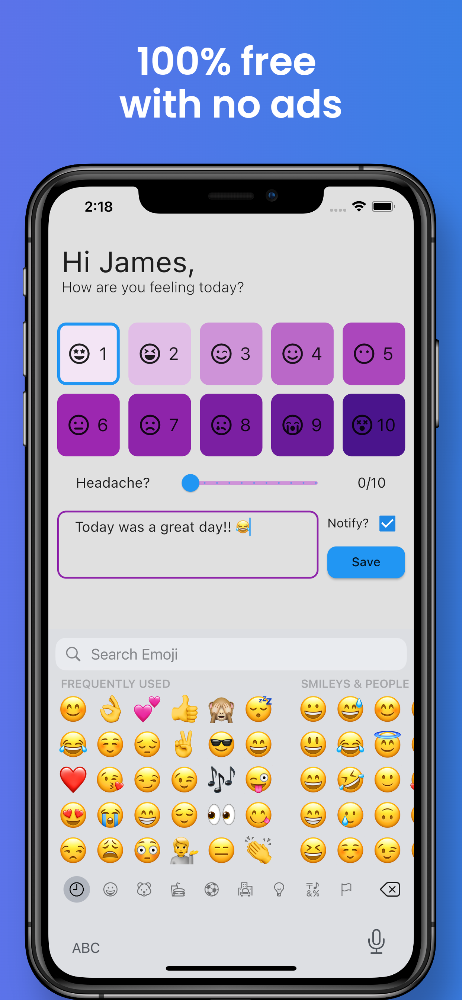
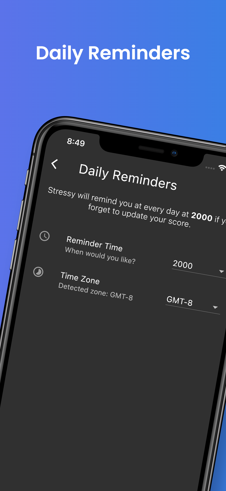
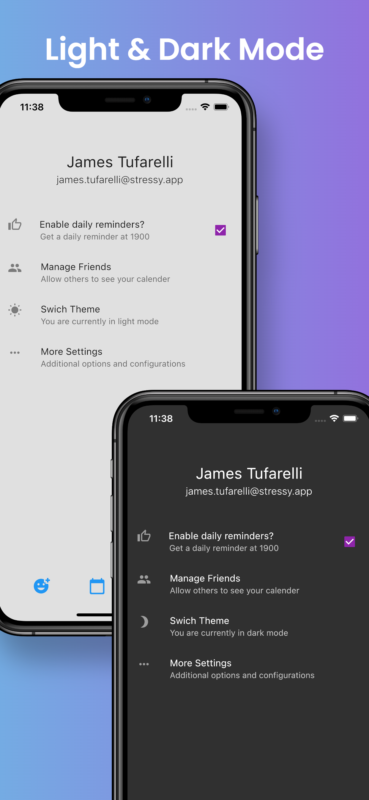

# Stressy

### Stressy helps you keep track of your stress levels and headaches. Rate your stress & headaches on a scale of 1-10. Stressy will automatically create a calendar to help you keep track of this data. Best of all, share with your friends to notify them how you are feeling.

 

## 🔧 Technologies

- Flutter
- Firebase
  - Authentication
  - Firestore Database
    - Jest Unit-tests
  - Cloud Functions
  - Cloud Storage
  - Analytics
  - Crashlytics
  - Performance
  - App Check (App Attest)
  - App Distribution
  - Cloud Messaging (Notifications)
- Fastlane
- Apple TestFlight
- React ([stressy.app](https://stressy.app))
- IOS and Android Flavors
